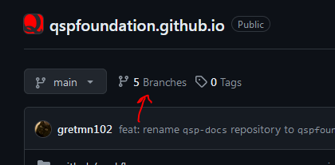

# Совместная разработка

Главный смысл совместной разработки заключается в том, чтобы не наступить друг другу на ноги. Для этого нужно придерживаться некоторых правил:

* Договариваемся в [#qsp_platform_dev](https://discord.com/channels/373163463842725891/749965798038306866) ([приглашение в ИФню](https://discord.gg/bbbdxhE9M2)), о чем будем писать
* Мы никак не трогаем ветку `main`
* Создаем и пользуемся своими ветками
* Сливаем все ветки через pull request
* Удаляем свои ветки за ненадобностью

## Пример

К примеру, кто-то взялся писать о подсветке синтаксиса. Для этого ему нужно:

* Подготовить среду разработки:
  * Склонировать хранилище:

    ```bash
    git clone https://github.com/QSPFoundation/qspfoundation.github.io.git
    ```

  * Зайти в папку с хранилищем и установить пакеты:

    ```bash
    cd qspfoundation.github.io
    npm install
    ```

  * Запустить live-сервер:

    ```bash
    npm run start
    ```

  * Перейти по ссылке в браузер

  Теперь страница в браузере с документацией будет автоматически обновляться с каждым сделанным изменением.
* Создать ветку `syntax-highlight`

  ```bash
  git checkout -b syntax-highlight
  ```

  Можно средствами редактора — без разницы.
* Создать файл `docs/syntax-highlighting.md` и начать писать в нем статью
* Добавить файл в git и закоммитить:

  ```bash
  git add docs/syntax-highlighting.md
  git commit -m "wip: мне было лень давать название"
  ```

  Сообщение можно давать какое-нибудь осмысленное, но всегда это получается, поэтому можно и так. Об осмысленности — ниже.
* Запушить на GitHub ветку:

  ```bash
  git push -u origin syntax-highlight
  ```

  Всё, теперь ветка лежит там. Чужие ветки не трогаем, а то запутаемся.

* Продолжить писать статью в `docs/syntax-highlighting.md`
* Добавить изменение файла в git и закоммитить:

  ```bash
  git add .
  git commit -m "wip: наконец-то дописал статью!"
  ```

* Запушить:

  ```bash
  git push
  ```

* Создать pull request из этой ветки через GitHub:

  * Перейти на страницу создания одним из двумя способов:
    * Через главную страницу хранилища:

      

    * Через ветки
      * Нажать на [branches](https://github.com/QSPFoundation/qspfoundation.github.io/branches)

        
      * Выбрать интересующую ветку, нажать на `...` и выпадающем меню выбрать "New Pull Request"

        
  * Осмысленно назвать pull request в поле "Add a title"

    Под осмысленным названием подразумевается что-то в духе:

    ```bash
    docs: write the syntax highlighting article
    ```

    В хранилище используется [распространенное соглашение об именовании коммитов](https://www.conventionalcommits.org/en/v1.0.0/).

* Как только pull request создастся, запустятся тесты (они определены в `.github/workflows/test-deploy.yml`. Они проверят, всё ли у в порядке с вашими изменениями

* Сообщите в ИФню, пускай ваш Pull Request кто-нибудь одобрит, и ждите

Как только ваш Pull Request одобрят, ваша ветка сольется с веткой `main`, автоматически запустится развертывание проекта (это настраивается в `.github/workflows\deploy.yml`), и через какое-то время можно будет увидеть изменения на сайте документации.

После слияния ветки она становится не нужна и ее нужно удалить, чтобы не мешалась:

* Удалить ветку с GitHub'а:

  ```bash
  git push -d origin syntax-highlighting
  ```

* Удалить ветку у себя на компьютере:

  ```bash
  git branch -d syntax-highlighting
  ```

* Удаление всех локальных веток, которых уже нет на GitHub:

  ```bash
  git fetch -p && git branch -vv | awk '/: \w+]/{print $1}' | xargs git branch -d --force
  ```

## Одобрение Pull Request

Если у вас есть права, то одобрить Pull Request можно тремя способами:

* `squash` — все коммиты с вашей ветки соединяются в один коммит (*если не уверены, то используйте этот метод*)

  Это надо, чтобы вот этот поток бессознательного:

  ```text
  wip: мне было лень давать название
  wip: наконец-то дописал статью!
  ```

  Превратить в один осмысленный:

  ```bash
  docs: write syntax highlighting article
  ```

* `rebase` — эта штука сливает новые коммиты в `main`

  Можно использовать, если у вас осмысленные коммиты, в духе:

  ```text
  docs(syntax-highlighting): start writing an article
  docs(syntax-highlighting): write short description of what syntax highlighting is
  ...
  ```

  Тогда всё это не стыдно кинуть прямо в `main` в таком виде.

* еще что-то, что сливает ветку через коммит. Забыл, как называется
